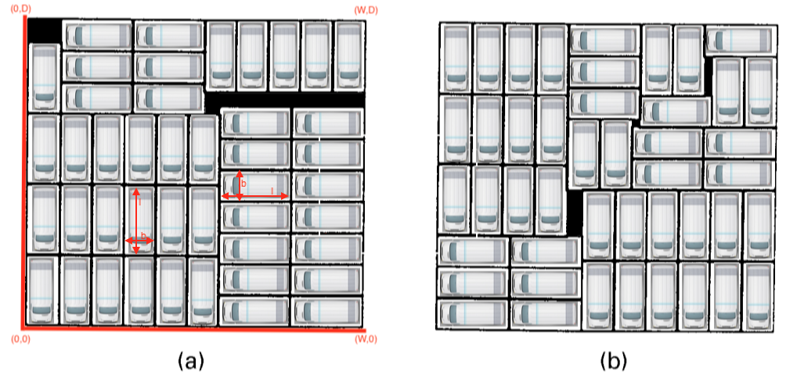

# OGD kerstpuzzel 2018

image::https://imgs.xkcd.com/comics/puzzle.png[link="https://imgs.xkcd.com/comics/puzzle.png"]

*Hoi BUSBietjes...*

Het is weer het einde van het jaar. Tijd voor de meeste van jullie om een à
twee weken verlof op te nemen. Maar twee weken zonder je werk is wel heel erg
afkicken natuurlijk. Daarom heb ik speciaal – om je niet te hoeven vervelen –
een heuse kerstpuzzel geschreven. Een beetje als de AIVD-kerstpuzzel. Maar dan
leuker!

Want deze puzzel kun je oplossen door te programmeren. En… je kunt ook een
echte prijs winnen. Hoe doe je dat? Stuur je oplossing in *voor 15 januari 2019*
bij mij. De beste inzending wint sowieso een waardebon van €25. Maar als jouw
algoritme beter presteert dan mijn implementatie dan verdubbel ik de prijs.
Kijk! Nu heb ik je aandacht ;-). Makkelijk scoren tegen zo’n Product Owner zou
ik zeggen… dus doe mee!

*De opdracht*

Ok, wat moet je doen? Schrijf een algoritme voor het BCPP. Het watte? Het BCPP
probleem. Dat staat voor “BUSBI’s Camper Parking Problem” en is een serieus
combinatorisch probleem waar we binnen de BUS mee in onze maag zitten. Zoals
je weet hebben we binnen de BUS grootse plannen. Daarom willen we het aantal
OGD campers fors uitbreiden. Om de kosten voor de benodigde stalling binnen de
perken te houden willen we zoveel mogelijk campers op een zo klein mogelijke
oppervlak kunnen stallen.

Probleempje... het formaat van de camper ligt nog niet vast. En ook de grootte
van de stalling nog niet. Dus we hebben een abstract algoritme nodig die
een optimale plaatsing kan berekenen in termen van `(W, D, l, b)`. De
oppervlakte van de stalling is `W * D` met `W > D`. De camper heeft het
formaat van `l` bij `b`, met `l > b`.

Tijd voor een voorbeeld. In het plaatje hieronder zie je twee mogelijke
uitwerkingen van de instantie (W,D,l,b)=(42,39,9,4). In (a) zijn er 44
campers geplaatst. In (b) 45. Uitwerking (b) is dus beter!



*Praktische zaken*

Om een eerlijke vergelijking mogelijk te maken is het natuurlijk nodig dat
iedereen zijn opdracht uitwerkt in dezelfde taal. Ik heb gekozen voor python.
Het moet een commandline programma zijn, welke als volgt is aan te roepen:
```
> kerstpuzzel2018.py <W> <D> <l> <b>
```
De uitvoer is een JSON-array met voor elke geplaatste camper een array met de
integer x,y-coordinaten van de linker-onderhoek en een letter H,V voor de
orientatie. Bijvoorbeeld, de (beetje ingekorte) uitvoer van (a) in het
voorbeeld zou zijn:
```
> kerstpuzzel.py 42 39 9 4
[[0,0,"V"],[4,0,"V"], ... ,[38,30,"V"]]
```
En van (b):
```
> kerstpuzzel.py 42 39 9 4
[[0,0,"H"],[9,0,"H"], ... ,[33,35,"H"]]
```

*Beoordelingscriteria*

Ik ga je python script (pre-compiled) 1000 keer aanroepen met iedere keer een andere case, van
makkelijk tot moeilijk. Voor elke case kun je 0, 1 of 2 punten verdienen. De
regels zijn:

  .	0 punten: timeout op max runtime van 30 sec. per case
  .	0 punten: de oplossing niet valide is (dus geen overlap e.d.)
  .	0 punten: `*N* < *min*`
  .	1 punt: `*min* < = *N* < *max*`
  .	2 punten: `*N* = *max*`

Waarbij *'N'* het aantal geplaatste campers is, het minimum
*'min'* = max[(W **div** l) * (D **div** b) , (W **div** b) * (D **div** l)] en
*'max'* het theoretisch maximum te plaatsen aantal.
De punten van alle cases tel ik op. Je kunt dus minimaal 0 en maximaal 2000
punten halen. Gelijk aantal punten? Dan wint degene met de laagste som van de
runtime van alle cases bij elkaar.

*Tips*

Je mag alle algoritmische technieken gebruiken die je maar wilt. Brute-force,
Branch-and-bound, Alpha-Beta-Pruning, tabu-search, divide-and-conquer,
hill-climbing, dynamic-programming, greedy, integer linear programming,
stochastic beam search, you name it.

Een genetisch algoritme (GA) mag ook natuurlijk, maar gaat je waarschijnlijk
niet de eerste plek opleveren. Een GA heeft vooral voordelen wanneer binnen de
genen 'zones' vormen die elk een afgebakende oppervlakte op de stallingplek
representeren. (Dit heet in de GA-literatuur trouwens 'schemata'). Maar in dat
geval zijn er constructieve alternatieven die veel sneller naar een resultaat
convergeren.

Oh ja… 0 punten scoren op een case zou echt niet nodig hoeven zijn! Met een
beetje time management en netjes programmeren zijn criteria 1 en 2 geen
probleem. Criterium 3 gaat over de triviale manier om de campers te
plaatsen. Dus da’s misschien een leuke initialisatie?! (Het verschil tussen
criterium 4 en 5 is moeilijker, maar daar gaat het nu juist om!)

*Twijfel niet langer!*

Wil je meedoen? Stuur dan een mailtje naar marcel.tode@ogd.nl. Dan krijgt je
een mapje in mijn gitrepo en kun je aan de slag.

Werk je niet bij de BUS en denk je van... ‘wow wat doen ze vette dingen bij de
BUSBI’. Dat klopt! Maar niet getreurd, ook jij mag meedoen. Win en breng jezelf
in ons vizier!

Na de deadline breng ik alle resultaten, software en tooling online, zodat
iedereen zelf alles kan checken. Ik hoop op veel aanmeldingen. Veel plezier!
En veel succes!

Fijne feestdagen en een gelukkig nieuwjaar alvast!
