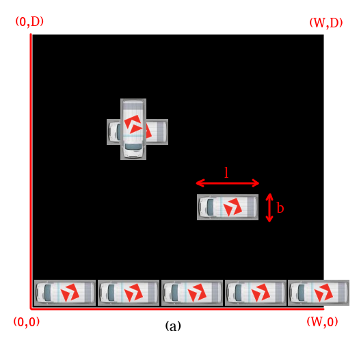
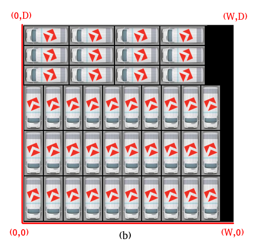
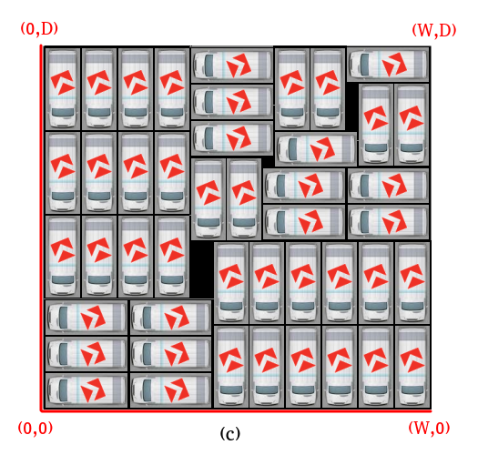

image::content/Kerst-trui.jpg[]

# OGD kerstpuzzel 2018

image::https://imgs.xkcd.com/comics/puzzle.png[link="https://imgs.xkcd.com/comics/puzzle.png"]

*OGD Kerstpuzzel 2018*

Het einde van het jaar staat weer voor de deur. Tijd voor de meeste mensen om
ongeveer twee weken lekker achterover te leunen en genieten van de gezellige
feestdagen. Twee weken zonder je werk is alleen wel heel erg afkicken (helemaal
als je baan meer dan werk is, zoals bij OGD). Daarom hebben we bij OGD iets
bedacht zodat jij je niet hoeft te vervelen; de OGD Kerstpuzzel. Het idee lijkt
een beetje op de AIVD-kerstpuzzel, maar dan leuker én voor programmeurs!

En… je kunt ook een echte prijs winnen! De beste drie inzendingen ontvangen
een Raspberry Pi compleet met toebehoren. Daarnaast zijn er nog 20 andere mooie
prijzen te verloten onder de overige deelnemers.

Hoe win je zo’n prijs? Stuur je oplossing in voor 15 januari 2019 naar
kerstpuzzel2018@ogd.nl.

*De opdracht*

Goed, laten we beginnen. Wat moet je doen? Schrijf een algoritme voor het OCPP.
Het watte? Dat staat voor “OGD Camper Parking Problem”. Het is een serieus
combinatorisch probleem waar we binnen de BUS (Business Unit Softwareontwikkeling) 
mee in onze maag zitten. Zoals je mogelijk weet hebben wij als OGD grootse 
plannen. Daarom willen we het aantal OGD-campers fors uitbreiden. Om de kosten 
voor de benodigde stalling binnen de perken te houden willen we zoveel mogelijk 
campers op een zo klein mogelijk oppervlak kunnen stallen.

Klein probleem... het formaat van de camper en ook de grootte van de stalling
liggen nog niet vast. Dus we hebben een abstract algoritme nodig die
een optimale plaatsing kan berekenen in termen van `(W, D, l, b)`. De
oppervlakte van de stalling is `W * D` met `W >= D > 0`. De camper heeft het
formaat van `l` bij `b`, met `l >= b > 0`.







Tijd voor een voorbeeld. In de plaatjes hierboven zie je een aantal
uitwerkingen van de instantie `(W,D,l,b)=(42,39,9,4)`:

a. Campers moeten binnen het terrein van de stalling vallen en campers op
   elkaar stapelen doen we liever niet. Deze uitwerking is niet valide.
   Als je deze oplossing inlevert krijg je 0 punten.

b. Met een 'naïef' algoritme kom je al heel ver. Zie hierboven 42 geplaatste
   campers. Je houdt nog wel ruimte over, maar altijd beter dan 0 punten.
   Toch 42 punten in de pocket!

c. Maar de echte uitdaging is natuurlijk om het optimum te vinden. Hier zie
   je een mogelijke uitwerking van het maximum aantal te plaatsen campers van 45.
   En dat levert je dus het maximum aantal punten van 45 op.

*Praktische zaken*

Schrijf een commandline programma in je favoriete programmeertaal. Zorg dat
duidelijk is hoe we je programma moeten bouwen indien nodig. We runnen de
inzendingen op een native draaiende fedora 29. Elke inzending wordt gethrottled
naar 1 core (pentium i5), 8 GB geheugen en 30 sec cpu tijd.

Om duidelijk te maken wat we als input en output verwachten is er een
kick-start Python3 script beschikbaar in de repo. Zo kun je gelijk aan de slag.
Andere talen gaan analoog. In ieder geval moet het programma de
volgende invoer accepteren:
```
> kerstpuzzel2018.py <W> <D> <l> <b>
```
De uitvoer is een JSON-array met voor elke geplaatste camper een dictionary met
de integer x,y-coordinaten van de linker-onderhoek en een letter H,V voor de
orientatie. Bijvoorbeeld, de ingekorte uitvoer van respectievelijk voorbeeld
twee en drie zouden zijn:
```
> kerstpuzzel.py 42 39 9 4
[{"x":0, "y":0, "o":"V"}, {"x":4, "y":0, "o":"V"}, ... , {"x":27, "y":35, "o":"H"}]

> kerstpuzzel.py 42 39 9 4
[{"x":0, "y":0, "o":"H"}, {"x":9, "y":0, "o":"H"}, ... , {"x":33, "y":35, "o":"H"}]
```

*Beoordelingscriteria*

We gaan je script 1000 keer aanroepen met iedere keer een andere case, van
makkelijk tot moeilijk. Puntentelling:

- Voor een oplossing die niet valide is (overlap etc.) en bij een timeout
  na 30 sec. krijg je geen punten.
- Verder is iedere geplaatste camper 1 punt.

De winnaar is degene met de meeste punten opgeteld over alle cases. Gelijk
aantal punten? Dan wint degene met mooiste implementatie.

*Tips*

Je mag alle algoritmische technieken gebruiken die je wilt. Brute-force,
Branch-and-bound, Alpha-Beta-Pruning, tabu-search, divide-and-conquer,
hill-climbing, dynamic-programming, greedy, integer linear programming,
stochastic beam search, genetisch algoritme, enzovoorts.

Oh ja… 0 punten scoren op een case zou echt niet nodig hoeven zijn! Met een
beetje time management en netjes programmeren hoef je niet in de valkuil van
het eerste criterium te vallen.

*Test je programmeer skills*

Denk jij dat je de puzzel kan oplossen? Twijfel dan niet langer en doe mee! Ga
dan naar https://github.com/OGDKerstpuzzel2018 en clone  de repository. Het
insturen van de oplossing kan door je code in een zip-bestand te mailen
naar kerstpuzzel2018@ogd.nl.

Na de deadline brengen we alle resultaten, software en tooling online. Zo kan
iedereen zelf alles nakijken en leren van elkaar. Heel veel plezier en
veel succes!

Namens alle OGD’ers,

Alvast fijne feestdagen en een gelukkig nieuwjaar!

image::content/Kerst-trui.jpg[]
